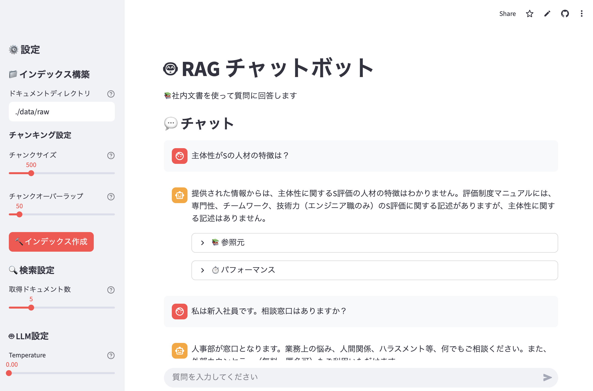

# RA## このプロジェクトについて

このプロジェクトは、RAG(Retrieval-Augmented Generation)技術を使用した質問応答システムです。PDF や Word 文書などをアップロードし、その内容について自然な日本語で質問すると、関連する情報を検索して回答を生成します。初心者むけのハンズオンを想定しています。


_RAG チャットボットのメイン画面_

https://ragchatbothandon202510.streamlit.app/ボット

社内文書を活用したセマンティック検索チャットボット

## このプロジェクトについて

このプロジェクトは、RAG（Retrieval-Augmented Generation）技術を使用した質問応答システムです。PDF や Word 文書などをアップロードし、その内容について自然な日本語で質問すると、関連する情報を検索して回答を生成します。初心者むけのハンズオンを想定しています。


https://ragchatbothandon202510.streamlit.app/

### RAG とは？

RAG（Retrieval-Augmented Generation）は、大規模言語モデル（LLM）と検索システムを組み合わせた技術です。

**従来の LLM の課題:**

- 学習データにない最新情報や専門知識には答えられない
- 回答の根拠が不明確

**RAG による解決:**

1. ユーザーの質問に関連する文書を検索
2. 検索した文書を参考に LLM が回答を生成
3. 参照元の文書も表示されるため、回答の根拠が明確

### 主な用途

- 社内マニュアル・規定の検索
- 技術文書の質問応答
- 報告書・議事録の検索
- FAQ 作成の補助

## 主な機能

### 基本機能

- **多様な文書形式に対応**: PDF、Word（.docx）、テキスト（.txt）、Markdown（.md）
- **セマンティック検索**: キーワードだけでなく、意味的に関連する情報を検索
- **自然言語での回答生成**: Google Gemini AI が文脈を理解して回答
- **参照元の表示**: 回答の根拠となった文書を表示
- **チャット形式の UI**: 使いやすい Web インターフェース

### 調整・最適化機能

- **パラメータ調整**: 検索精度や回答の創造性を調整可能
- **パフォーマンス計測**: 検索時間や処理時間を表示
- **チャンキング設定**: 文書の分割方法を調整して検索精度を向上

## 技術スタック

| カテゴリ       | 技術                      | 説明                   |
| -------------- | ------------------------- | ---------------------- |
| LLM            | Google Gemini 2.5 Flash   | 回答生成               |
| Embedding      | Google text-embedding-004 | 文書のベクトル化       |
| フレームワーク | LangChain                 | RAG パイプラインの構築 |
| ベクトル DB    | ChromaDB                  | 文書の保存・検索       |
| UI             | Streamlit                 | Web インターフェース   |
| デプロイ       | Streamlit Community Cloud | クラウドホスティング   |

### なぜこの技術を選んだのか？

詳細は[技術選定理由.md](技術選定理由.md)を参照してください。主なポイント:

- **Google Gemini**: 無料で高性能、大きなコンテキストウィンドウ
- **LangChain**: 豊富なドキュメントと活発なコミュニティ
- **ChromaDB**: セットアップが簡単、小規模データに最適
- **Streamlit**: 数行のコードで美しい UI を構築可能

## セットアップ

### 前提条件

- Python 3.9 以上
- Google アカウント（Google AI Studio API キー取得用）

### 1. リポジトリのクローン

```bash
git clone https://github.com/yourusername/rag-chatbot.git
cd rag-chatbot
```

### 2. 仮想環境の作成と有効化

**macOS / Linux:**

```bash
python -m venv venv
source venv/bin/activate
```

**Windows:**

```bash
python -m venv venv
venv\Scripts\activate
```

仮想環境が有効化されると、プロンプトが `(venv)` で始まります。

### 3. 依存パッケージのインストール

```bash
pip install -r requirements.txt
```

### 4. Google AI Studio API キーの取得

1. [Google AI Studio](https://aistudio.google.com/)にアクセス
2. Google アカウントでログイン
3. 「Get API Key」をクリック
4. 「Create API Key」で API キーを生成
5. 生成された API キーをコピー

### 5. 環境変数の設定

プロジェクトルートに `.env` ファイルを作成:

```bash
# .envファイルを作成
touch .env
```

`.env` ファイルに以下を記述:

```
GOOGLE_API_KEY=your-api-key-here
```

**重要:** `your-api-key-here` を実際の API キーに置き換えてください。

### 6. サンプルドキュメントの配置

`data/raw/` ディレクトリに検索対象の文書を配置してください。

サンプルとして、以下のドキュメントが含まれています:

- 就業規則
- 経費精算マニュアル
- 備品購入フロー
- FAQ 文書

独自の文書を使用する場合は、`data/raw/` 内のファイルを置き換えてください。

### 7. アプリケーションの起動

```bash
streamlit run app.py
```

ブラウザが自動的に開き、アプリケーションが表示されます。
開かない場合は、ターミナルに表示される URL（通常は `http://localhost:8501`）にアクセスしてください。

## 使い方

### 基本的な流れ

#### 1. インデックスの作成

初回起動時、または新しいドキュメントを追加した際に必要です。

1. サイドバーの「インデックス構築」セクションを確認
2. ドキュメントディレクトリが正しいか確認（デフォルト: `./data/raw`）
3. 必要に応じてチャンクサイズとオーバーラップを調整
4. 「インデックス作成」ボタンをクリック
5. 処理完了まで待機（数百ファイルで数分程度）

**チャンクサイズとは？**

- 文書を小さな塊（チャンク）に分割する際のサイズ
- 小さすぎる: 文脈が失われる
- 大きすぎる: 検索精度が下がる
- デフォルト（500 文字）で問題ない場合が多い

**オーバーラップとは？**

- チャンク間で重複させる文字数
- 文脈の連続性を保つために使用
- デフォルト（50 文字）で通常は十分

#### 2. 質問の入力

1. 画面下部のチャット入力欄に質問を入力
2. Enter キーを押すか、送信ボタンをクリック
3. 回答が生成されるまで待機（通常 5 秒以内）

**質問の例:**

- 「有給休暇は何日取得できますか？」
- 「経費精算の期限はいつですか？」
- 「会議室の予約方法を教えてください」
- 「出張申請はどのように行いますか？」

#### 3. 結果の確認

回答と共に以下が表示されます:

- **参照元**: 回答の根拠となった文書
- **パフォーマンス**: 処理時間の詳細

参照元を確認することで、回答の信頼性を判断できます。

### パラメータの調整

サイドバーで以下のパラメータを調整できます:

#### 検索設定

**取得ドキュメント数（top_k）**

- 検索で取得する関連文書の数
- デフォルト: 5 件
- 多いほど情報量が増えるが、処理時間も増加

#### LLM 設定

**Temperature**

- 回答の創造性を調整
- 0.0: 決定的（毎回同じ回答）
- 1.0: 創造的（毎回異なる可能性）
- デフォルト: 0.0（事実ベースの質問応答に最適）

### トラブルシューティング

#### エラー: 「Google API Key が設定されていません」

**原因:** `.env` ファイルが存在しないか、API キーが正しくない

**対処法:**

1. `.env` ファイルがプロジェクトルートにあるか確認
2. ファイル内に `GOOGLE_API_KEY=your-api-key-here` が記述されているか確認
3. API キーが正しいか確認（Google AI Studio で確認）
4. アプリケーションを再起動

#### エラー: 「ドキュメントが見つかりませんでした」

**原因:** `data/raw/` ディレクトリにファイルがない、または対応していない形式

**対処法:**

1. `data/raw/` ディレクトリにファイルがあるか確認
2. ファイル形式が対応しているか確認（PDF, DOCX, TXT, MD）
3. ファイルが破損していないか確認

#### エラー: 「レート制限に達しました」

**原因:** Google AI Studio API の無料枠制限（1 分間に 15 リクエスト）

**対処法:**

1. 1 分程度待ってから再試行
2. 連続して質問する場合は間隔を空ける

#### 検索精度が低い

**対処法:**

1. チャンクサイズを調整（300〜800 の範囲で試す）
2. 取得ドキュメント数を増やす（5〜10 件）
3. 質問をより具体的にする
4. インデックスを再作成

## API 制限

Google AI Studio API の無料枠には以下の制限があります:

- **1 日あたり**: 1,500 リクエスト
- **1 分あたり**: 15 リクエスト
- **コスト**: 完全無料

これらの制限を超えた場合、リクエストは失敗します。本番環境で使用する場合は、有料の Vertex AI への移行を検討してください。

## セキュリティ上の注意

### API キーの管理

- **絶対に Git にコミットしないでください**
- `.env` ファイルは `.gitignore` に含まれています
- 公開リポジトリに API キーをプッシュしないよう注意してください
- 万が一 API キーが漏洩した場合は、直ちに Google AI Studio で無効化してください

### 確認方法

```bash
# APIキーがGit履歴に含まれていないか確認
git log -p | grep -i "GOOGLE_API_KEY"
```

何も表示されなければ安全です。

## プロジェクト構成

```
rag-chatbot/
├── .env                      # 環境変数（APIキー）※Gitに含めない
├── .gitignore               # Git除外設定
├── requirements.txt         # Pythonパッケージ
├── README.md               # このファイル
├── 要件定義.md              # 詳細な要件定義
├── 技術選定理由.md          # 技術選定の背景
│
├── app.py                  # Streamlitメインアプリ
│
├── config/
│   ├── __init__.py
│   └── settings.py         # 設定ファイル
│
├── src/
│   ├── __init__.py
│   ├── document_loader.py  # ドキュメント読み込み
│   ├── text_splitter.py    # テキスト分割
│   ├── embeddings.py       # Embedding生成
│   ├── vector_store.py     # ベクトルDB操作
│   ├── retriever.py        # 検索機能
│   └── qa_chain.py         # QAチェーン
│
├── utils/
│   ├── __init__.py
│   ├── file_handler.py     # ファイル処理
│   └── performance.py      # パフォーマンス計測
│
├── data/
│   ├── raw/               # 元ドキュメント
│   └── processed/         # 処理済みデータ
│
├── chroma_db/             # ChromaDB永続化ディレクトリ
│
└── tests/                 # テストコード
    ├── __init__.py
    └── test_chunking.py   # チャンキングテスト
```

## 開発の背景

このプロジェクトは、以下の目的で開発されました:

1. **学習目的**: RAG の基本から最適化までを実践的に学ぶ
2. **実用性**: 実際に使えるツールを作る
3. **低コスト**: 完全無料で構築可能
4. **短期間**: 1 週間で完成可能な規模

詳細は[要件定義.md](要件定義.md)を参照してください。

## 制約事項

### 技術的制約

- **データ規模**: 数百〜数千ドキュメントを想定（ChromaDB の限界）
- **同時接続**: 5-10 ユーザー程度（Streamlit Community Cloud の制限）
- **メモリ**: 1GB（Streamlit Community Cloud の制限）
- **ファイルサイズ**: 1 ファイルあたり 10MB 以内を推奨

### 運用上の制約

- 本番環境での運用は想定していない
- セキュリティ対策は最小限
- データのバックアップ機能なし
- 商用利用の場合は Google AI の利用規約を確認してください

## 免責事項

このプロジェクトは学習目的で作成されたものです。本番環境での使用は想定していません。使用により生じたいかなる損害についても責任を負いません。

## 参考リンク

- [Google AI Studio](https://aistudio.google.com/)
- [LangChain Documentation](https://python.langchain.com/)
- [ChromaDB Documentation](https://docs.trychroma.com/)
- [Streamlit Documentation](https://docs.streamlit.io/)

質問や問題が発生した場合は、GitHub の Issues でお知らせください。
